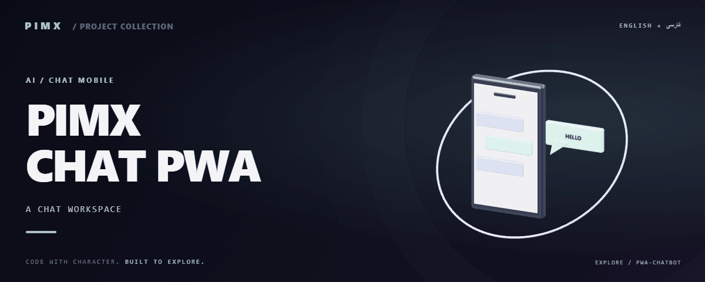

<div align="center">



**[English](README.md) · [فارسی](README.fa.md)**


</div>

# PIMX CHAT PWA

پروژه گفتگو با هوش مصنوعی در Node/Express، پوشه وب pimxchat، صفحات چندزبانه و ابزار ذخیره‌سازی SQLite.

[GitHub](https://github.com/MOHAMMADREZAABEDINPOOR/pwa-chatbot) · [PIMX / Profile](https://github.com/MOHAMMADREZAABEDINPOOR) · [بنر ثابت](assets/readme/hero.png)

## امکانات

- صفحه گفتگو و منابع زبان محلی
- سرور Express/Node و وابستگی Google AI
- ابزار SQLite برای نگهداری سابقه
- وابستگی پراکسی برای محیط‌های تنظیم‌شده

## پشته فنی

| ابزار | نسخه یا منبع |
|---|---|
| Express | `^5.1.0` |

## شروع کار

Node.js 22.12 یا بالاتر و مدیر پکیج مشخص‌شده در package.json. نسخه وابستگی‌ها را مطابق فایل قفل نصب کنید.

```bash
git clone https://github.com/MOHAMMADREZAABEDINPOOR/pwa-chatbot.git
cd pwa-chatbot

npm ci
cd pimxchat
node server.js
```

## تنظیمات

فایل محیط استاندارد تعریف نشده است. برای تمرین‌های مستقل تنظیم خارجی لازم نیست؛ اگر در کد ثابت‌های سرویس یا مسیر وجود دارد، آن‌ها را پیش از اجرا بررسی کنید.

## استفاده

تنظیم سرور و سرویس را در pimxchat/server.js و pimxchat/config.js بررسی کنید. وابستگی ریشه را نصب و سرور را از پوشه وب اجرا کنید.

## ساختار پروژه

| مسیر | نقش |
|---|---|
| [`assets/`](assets/) | فایل برند، رسانه و README |
| [`pimxchat/`](pimxchat/) | ماژول گفتگو و وب |
| [`package.json`](package.json) | فایل ورودی یا تنظیم پروژه |

## فرمان‌ها و بررسی

فرمان آزمون خودکار در manifest تعریف نشده است. اجرای محلی و بررسی رفتار نمونه را انجام دهید.

## استقرار

فرایند Node با API و ذخیره SQLite به هاست دارای دیسک پایدار نیاز دارد. فایل وب به‌تنهایی بک‌اند هوش مصنوعی را اجرا نمی‌کند.

## محدودیت‌ها

چند فایل سرور وجود دارد و npm start تعریف نشده است. فایل ورودی و اعتبارنامه احتمالی را پیش از استقرار بررسی کنید. پاسخ هوش مصنوعی حتی با کش فایل‌ها به شبکه نیاز دارد.

## رفع مشکل

- پکیج غایب: وابستگی را با مدیر پکیج پروژه نصب کنید.
- خطای API یا شبکه: آدرس، سرویس و اتصال میزبانی را بررسی کنید.
- فایل قدیمی: در صورت وجود اسکریپت ساخت، build و کش مرورگر را تازه کنید.

## مشارکت

برای تغییر، شاخه مستقل بسازید، رفتار فعلی را بررسی کنید و توضیح روشن همراه تغییر بفرستید. اطلاعات خصوصی، خروجی build و دیتابیس محلی را commit نکنید.

## مجوز

فایل مجوز در این نسخه موجود نیست. نمایش عمومی کد به‌تنهایی مجوز استفاده مجدد نیست؛ برای شرایط استفاده با مالک مخزن هماهنگ کنید.

---

ساخته‌شده در مجموعه **PIMX** · مستندات فارسی و انگلیسی.
